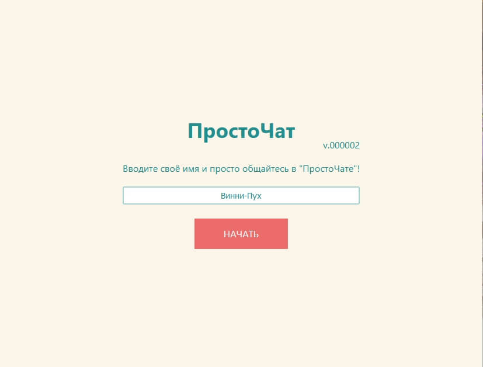
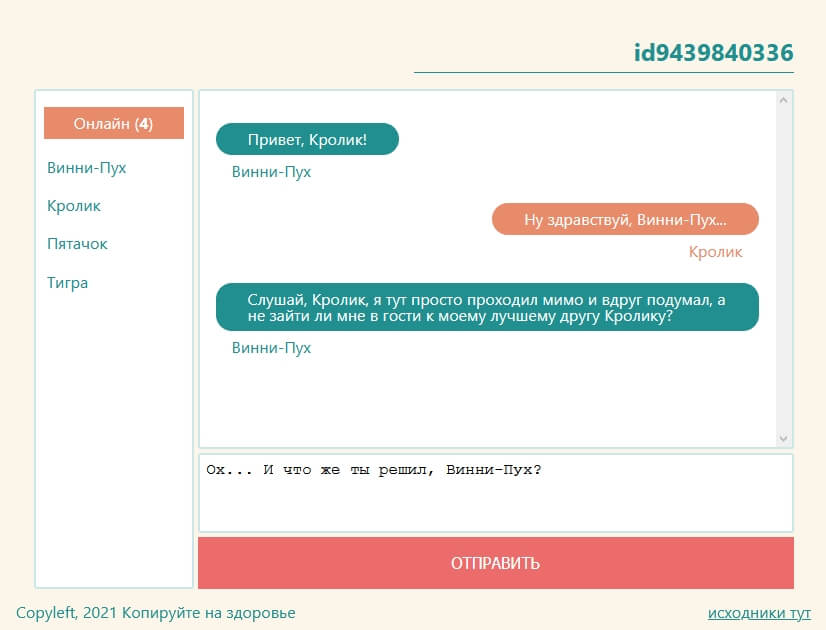

# ПростоЧат

Незатейливый чат, ничего необычного. Требуется только ввести имя. Название комнаты генерируется автоматически. Собеседники могут присоединяться по ссылке.

### Запуск

Front - **yarn start**\
Back - **yarn server**

## Стэк
### На бэке:
NodeJS, ExpressJS, Socket.io, база сидит в объекте, чат схлопывается, если в нём не остаётся посетителей.

### На фронте:
ReactJS, Socket.io-client, Redux, хуки (немного)

## Скриншоты
**Вход в чат - достаточно ввести имя**

**В чате есть список пользователей онлайн, работает автоскролл, разный стиль для своих и чужих сообщений**

